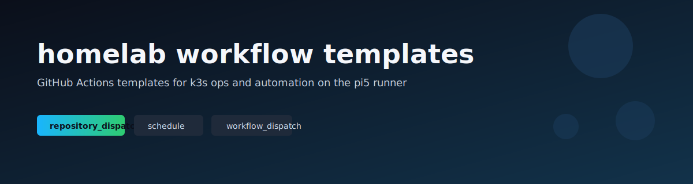
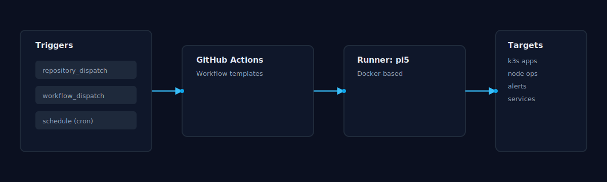

# homelab-workflow-templates

Templates for GitHub Actions workflows that run on the homelab self-hosted
runner (`pi5`, Docker-based).

## Visual overview

## Runner labels
- `self-hosted`
- `pi5`
- `docker`

## Templates
- `dispatch-example.yml`: repository_dispatch + workflow_dispatch with payload parsing.
- `scheduled-healthcheck.yml`: scheduled URL check with optional secret.
- `manual-deploy.yml`: manual deploy scaffold (kubectl-based).
- `k3s-rollout-check.yml`: verify deployment rollout status.
- `k8s-node-drain.yml`: cordon + drain a node (manual).

## Docs
Each workflow has a matching guide in `docs/`.

## Required secrets (per workflow)
Check each workflow file for required secrets or inputs.
